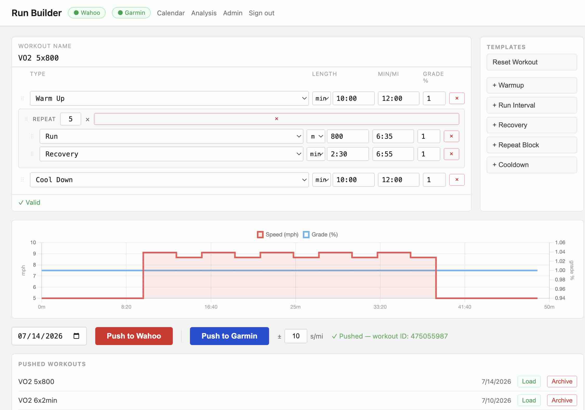
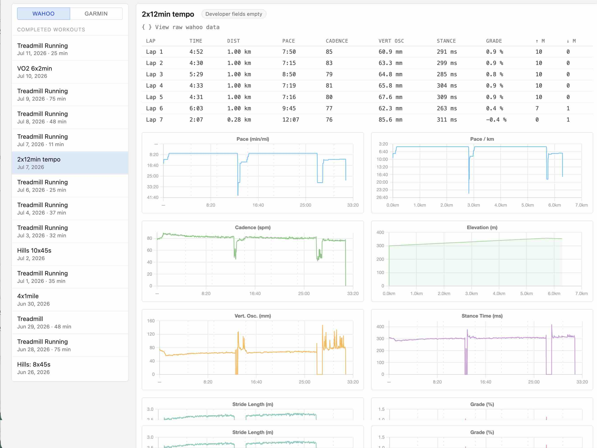

# Run Builder


Another way to create and push workouts to your KICKR Run and/or get raw workout data for analysis.


- **Editor** — build interval workouts (warmup, run, recovery, cooldown, repeat
  blocks) with per-interval pace and grade; visualize with Chart.js; push to
  Wahoo and/or Garmin. 
	- distance in meters
	- time in minutes:seconds
	- pace in minutes/mile
	- incline in %
- **Calendar** — monthly view of pushed workouts; click to reload one into the editor.
- **Analysis** — parse completed Wahoo/Garmin FIT files into pace, cadence,
  heart rate, vertical oscillation, stance time, stride, grade, and elevation
  charts, with per-lap tables and a raw-JSON viewer.

> [!CAUTION]
> large pace changes between intervals can cause you to lose your balance. 
> E.g. Instead of 6:00 min/mile pace to 10:00 set the change as 6:20. Then when the new interval starts adjust your pace manually to 10:00

## Screenshots

**Workout builder** — build intervals, preview the pace/grade chart, and push to Wahoo and/or Garmin.



**Analysis** — completed-run metrics parsed from the FIT file.



## Stack

FastAPI · SQLAlchemy · SQLite · Pydantic v2 · Jinja2 · Chart.js v4 ·
[`uv`](https://docs.astral.sh/uv/) for Python packaging.

## Prerequisites

- Python 3.11+
- [`uv`](https://docs.astral.sh/uv/getting-started/installation/)
- A Wahoo Cloud API app for the Wahoo integration — register at
  [developers.wahooligan.com/applications](https://developers.wahooligan.com/applications)
  to get a client ID/secret (apps require Wahoo approval)
- A Garmin Connect account for the Garmin integration
- If it's just for you, run locally. One way to make accessible for others would be to expose by a cloudflare tunnel

## Setup

```bash
git clone <your-fork-url> kickr && cd kickr
uv sync                       # install dependencies into .venv
cp .env.example .env          # then fill in the values (see below)
```

### Configure `.env`

| Var                                       | Required  | Notes                                                                               |
| ----------------------------------------- | --------- | ----------------------------------------------------------------------------------- |
| `SESSION_SECRET`                          | ✅         | Random string used to sign session cookies.                                         |
| `INVITE_CODE`                             | ✅         | Shared code required to register. Must not be the placeholder.                      |
| `FERNET_KEY`                              | ✅         | Encrypts Wahoo/Garmin tokens at rest. No completed workout data stored. See below.  |
| `WAHOO_CLIENT_ID` / `WAHOO_CLIENT_SECRET` | for Wahoo | From your Wahoo Cloud API app.                                                      |
| `REDIRECT_URI`                            | for Wahoo | OAuth callback URL, e.g. `http://127.0.0.1:9000/auth/wahoo/callback`.               |
| `HTTPS_ONLY`                              |           | `true` in production (behind HTTPS), `false` for local dev.                         |
| `DATABASE_URL`                            |           | Defaults to `sqlite:///./kickr.db`.                                                 |

### Generating secrets

`FERNET_KEY` must be a valid [Fernet](https://cryptography.io/en/latest/fernet/)
key (32-byte url-safe base64). Generate one with:

```bash
uv run python -c "from cryptography.fernet import Fernet; print(Fernet.generate_key().decode())"
```

Copy the output into `FERNET_KEY=` in your `.env`. The app **validates this at
startup and refuses to boot** without a valid key, since third-party tokens are
always encrypted before being stored. Keep the key safe and back it up — if you
lose or change it, stored Wahoo/Garmin connections can no longer be decrypted
and users simply reconnect (no data is corrupted).

While you're here, generate a `SESSION_SECRET` too:

```bash
uv run python -c "import secrets; print(secrets.token_urlsafe(32))"
```

## Run

```bash
uv run uvicorn app.main:app --reload --port 9000
```

Open http://127.0.0.1:9000. Register with your `INVITE_CODE` — **the first
registered user becomes the admin**. Connect Wahoo (OAuth redirect) and/or
Garmin (email + password, MFA supported) from the header status pills.

> **Single worker only.** The Garmin MFA flow and the login/register rate
> limiter use in-process state, so run one uvicorn worker (the default).

## Deployment (Cloudflare Tunnel)

The app is a plain ASGI server — put it behind any TLS terminator / reverse
proxy. The setup it was built for is a machine on a home network (no static IP,
no port forwarding) exposed via a **Cloudflare Tunnel**, which also provides free
TLS. Using nginx/Caddy/Traefik or anything else instead? Read
[Deploying without Cloudflare](#deploying-without-cloudflare) — a couple of
defaults assume Cloudflare and need adjusting.

### Production `.env`

- `HTTPS_ONLY=true` — marks session cookies `Secure` (Cloudflare terminates TLS).
- `REDIRECT_URI=https://run.your-domain.example/auth/wahoo/callback` — must
  exactly match the callback URL registered in your Wahoo Cloud API app.
- Run a **single uvicorn worker** (in-process MFA + rate-limit state).

### Tunnel setup

See Cloudflare's official guide for the authoritative steps —
[Create a locally-managed tunnel](https://developers.cloudflare.com/cloudflare-one/connections/connect-networks/get-started/create-local-tunnel/)
(and the [Cloudflare Tunnel overview](https://developers.cloudflare.com/cloudflare-one/connections/connect-networks/)).
In short:

1. Add your domain to Cloudflare (the free plan works) and install
   [`cloudflared`](https://developers.cloudflare.com/cloudflare-one/connections/connect-networks/downloads/)
   on the host.
2. Authenticate and create a named tunnel:
   ```bash
   cloudflared tunnel login
   cloudflared tunnel create runbuilder
   cloudflared tunnel route dns runbuilder run.your-domain.example
   ```
3. Point the tunnel at the local app in `~/.cloudflared/config.yml` (on Windows:
   `%USERPROFILE%\.cloudflared\config.yml`):
   ```yaml
   tunnel: runbuilder
   credentials-file: /path/to/<tunnel-id>.json
   ingress:
     - hostname: run.your-domain.example
       service: http://127.0.0.1:9000
     - service: http_status:404
   ```
4. Start the app (`start.bat`, or `uv run uvicorn app.main:app --port 9000`) and
   the tunnel:
   ```bash
   cloudflared tunnel run runbuilder
   ```

### Things to know behind Cloudflare

- **Real client IP:** the rate limiter reads `CF-Connecting-IP` (set by
  Cloudflare); it falls back to the socket address for direct/local access.
  Without it, every request would appear to come from the tunnel and share one
  bucket.
- **Error codes:** Cloudflare intercepts `502` responses and returns its own HTML
  error page, which breaks JSON error handling in the browser. Endpoints wrapping
  external APIs return `422` instead — do the same for any you add.
- **Keeping it running (Windows):** launch `start.bat` and the tunnel at login via
  Task Scheduler, or install cloudflared as a service (`cloudflared service
  install`).

### Edge hardening (Cloudflare)

The production deployment layers Cloudflare's edge protections on top of the
app's own controls (configured in the Cloudflare dashboard):

- **Rate limiting rules** — edge rate-limiting on the auth endpoints (`/login`,
  `/register`), complementing the in-process limiter in `app/ratelimit.py`.
  Exact thresholds live in the Cloudflare dashboard (WAF → Rate limiting rules).
- **Managed WAF ruleset** — Cloudflare Managed Rules filter common malicious
  traffic before it reaches the origin.
- **Bot Fight Mode** — challenges automated/bot traffic.
- **SSL/TLS: Full (Strict)** — end-to-end TLS with origin certificate validation
  (pair with *Always Use HTTPS*).

Keep `HTTPS_ONLY=true` so session cookies are `Secure`, and rely on
`CF-Connecting-IP` for the real client address (see above).

### Deploying without Cloudflare

The Cloudflare-specific bits above degrade quietly if you swap in a different
reverse proxy (nginx, Caddy, Traefik, …). What to know:

- **The rate limiter will lump all your users together.** `app/ratelimit.py`
  identifies clients by `CF-Connecting-IP` only — it does **not** read
  `X-Forwarded-For` / `X-Real-IP`. Behind a generic proxy every request appears
  to come from the proxy's own address, so the `/login`, `/register`, and Garmin
  connect limits become **one shared bucket for everyone**: two people mistyping
  passwords can lock the whole household out, and per-client brute-force
  protection is effectively gone. Fix one of two ways:
  - adapt `_client_ip()` in `app/ratelimit.py` to read your proxy's client-IP
    header (keep the existing rule of only trusting it when the direct peer is
    loopback/private), or
  - enforce equivalent per-IP limits at the proxy itself (nginx `limit_req`,
    Caddy `rate_limit`) and accept the shared in-app bucket as a coarse backstop.
- **You lose the whole edge-protection layer.** The WAF, bot filtering, and edge
  rate limiting described under [Edge hardening](#edge-hardening-cloudflare) are
  Cloudflare dashboard features. Without them the in-process limiter is the
  *only* brute-force control, and the app itself sets **no security headers** —
  add them at your proxy: `Strict-Transport-Security`, `X-Frame-Options: DENY`
  (or CSP `frame-ancestors 'none'`), `X-Content-Type-Options: nosniff`,
  `Referrer-Policy: strict-origin-when-cross-origin`.
- **Tell uvicorn about your proxy.** Run with
  `--proxy-headers --forwarded-allow-ips=127.0.0.1` (or your proxy's address) so
  forwarded client IPs and the `https` scheme are honored.
- **Never expose uvicorn directly to the internet.** Always terminate TLS in
  front of it — with `HTTPS_ONLY=true` the session cookie is `Secure` and simply
  won't be sent over plain HTTP, and without a proxy there is no header/WAF layer
  at all.
- **Unchanged either way:** `HTTPS_ONLY=true` behind any TLS terminator,
  `REDIRECT_URI` must match your public callback URL, and the single-worker
  requirement still applies. The 422-instead-of-502 error convention is a
  Cloudflare workaround and is harmless on other setups.

## Tests

```bash
uv run pytest
```

## Security

- **Token encryption at rest** — Wahoo/Garmin tokens are encrypted with Fernet
  (`FERNET_KEY`, required).
- **Auth** — bcrypt password hashing; admin status always checked against the DB,
  never trusted from the session cookie.
- **Session revocation** — every authenticated request compares the session
  cookie's `session_version` against the DB. Logging out or changing a password
  bumps the version, immediately invalidating all outstanding cookies for the
  account (signing out on one device signs out everywhere; a password change
  keeps the current device signed in).
- **Rate limiting** — login, registration, and the Garmin connect endpoints are
  rate-limited per client IP at the app level (`app/ratelimit.py`), backed by a
  Cloudflare edge rate-limiting rule in production. Client IPs come from
  `CF-Connecting-IP` — on a non-Cloudflare setup see
  [Deploying without Cloudflare](#deploying-without-cloudflare).
- **CSRF** — session cookies are `SameSite=lax` and all state-changing routes are
  POST.
- **XSS** — user/external strings are escaped before rendering.
- **Edge protections (Cloudflare)** — production runs behind Cloudflare with a
  managed WAF ruleset, Bot Fight Mode, and SSL/TLS Full (Strict). See
  [Deployment → Edge hardening](#edge-hardening-cloudflare).

Do not commit your `.env`, `kickr.db`, or `logs/` — they are gitignored by default.

## Development notes

See [CLAUDE.md](CLAUDE.md) for architecture details, the file map, and the
non-obvious gotchas (Wahoo/Garmin workout formats, Cloudflare error-code
handling, FIT parsing quirks).

## License

[PolyForm Noncommercial 1.0.0](LICENSE.md) — free to use, modify, and share
for personal and other noncommercial purposes. Commercial use is not licensed.

Required Notice: Copyright David Meyer (https://github.com/dameyer)

---

<p align="center">
  <em>Created in collaboration with Claude Code</em>
  <br><br>
  <a href="https://claude.com/claude-code">
    
  </a>
</p>
